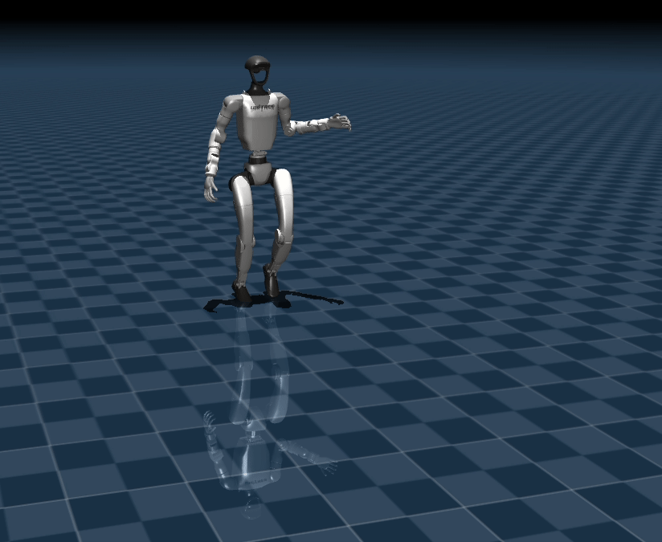
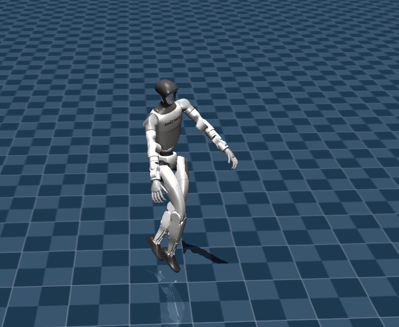
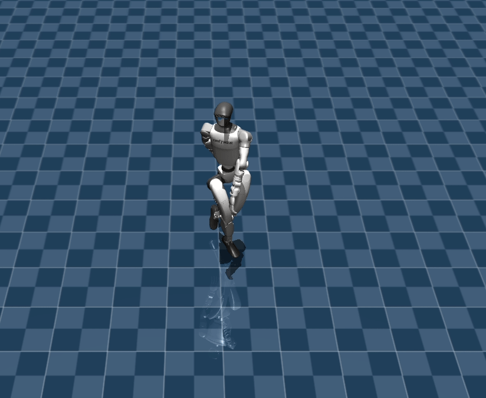

# AMASS Dataset Toolkit

A comprehensive toolkit for exploring, analyzing, and playing AMASS dataset (retargeted to G1 robot).

The retargeted AMASS dataset for G1 is from [here](https://huggingface.co/datasets/ember-lab-berkeley/AMASS_Retargeted_for_G1)

## Demo Examples

<table>
  <tr>
    <td></td>
    <td></td>
    <td></td>
  </tr>
</table>

## 📁 Project Structure

```
AMASS_Retargeted_for_G1/
├── g1/                          # Dataset directory
│   ├── BioMotionLab_NTroje/     # BioMotionLab data
│   ├── CMU/                     # CMU motion capture data
│   ├── DanceDB/                 # Dance database
│   └── ...                      # Other datasets
├── scripts/                     # Tool scripts
│   ├── data_explorer.py         # Data exploration tool
│   ├── quick_view.py            # Quick view tool
│   ├── action_analyzer.py       # Action type analysis tool
│   ├── mujoco_player.py         # Original player
│   └── mujoco_player_fixed.py   # Fixed player (recommended)
├── README.md                    
└── Tutorial.md                    

```

## 🛠️ Tool Overview

| Tool | Function | Recommendation |
|------|----------|----------------|
| `data_explorer.py` | Complete dataset exploration and analysis | ⭐⭐⭐⭐⭐ |
| `quick_view.py` | Quick view and statistics | ⭐⭐⭐⭐ |
| `action_analyzer.py` | Action type classification and analysis | ⭐⭐⭐⭐ |
| `mujoco_player_fixed.py` | Motion player (fixed version) | ⭐⭐⭐⭐⭐ |

## 🚀 Quick Start

### 0. Dataset Download 

#### Clone AMASS Retargeted for G1 Dataset

Make sure git-lfs is installed (https://git-lfs.com)
```bash
git lfs install

git clone https://huggingface.co/datasets/ember-lab-berkeley/AMASS_Retargeted_for_G1
```

#### Copy the g1 folder to the root of this repository


### 1. Dataset Overview
```bash
# View overall dataset status
python scripts/quick_view.py --action overview

# View dataset statistics
python scripts/data_explorer.py --action scan
```

### 2. Find Specific Actions
```bash
# Find short actions (suitable for testing)
python scripts/quick_view.py --action short --max_duration 5

# Find specific types of actions
python scripts/action_analyzer.py --action analyze --dataset DanceDB
```

### 3. Play Actions
```bash
# Play action file
python scripts/mujoco_player_fixed.py g1/CMU/102/102_11_poses_120_jpos.npz
```

## 📊 Data Exploration Tool (data_explorer.py)

### Features
- Dataset scanning and statistics
- File content analysis
- Action search and filtering
- Statistical chart generation
- Data export functionality

### Usage Examples

```bash
# Scan entire dataset
python scripts/data_explorer.py --action scan

# Analyze single file
python scripts/data_explorer.py --action analyze --file g1/CMU/102/102_11_poses_120_jpos.npz

# Find actions with specific duration
python scripts/data_explorer.py --action find --min_duration 3 --max_duration 10

# Generate statistical charts
python scripts/data_explorer.py --action plot --output stats.png

# Export file list
python scripts/data_explorer.py --action export --output file_list.txt
```

### Parameters
- `--action`: Operation type (scan/analyze/find/plot/export)
- `--file`: Specify file path
- `--min_duration`/`--max_duration`: Action duration range
- `--output`: Output file path

## ⚡ Quick View Tool (quick_view.py)

### Features
- Quick dataset statistics
- File content preview
- Short action search
- Dataset listing

### Usage Examples

```bash
# Dataset overview
python scripts/quick_view.py --action overview

# View file information
python scripts/quick_view.py --action preview --file g1/CMU/102/102_11_poses_120_jpos.npz

# Find short actions
python scripts/quick_view.py --action short --max_duration 5

# List dataset contents
python scripts/quick_view.py --action list --dataset CMU
```

### Parameters
- `--action`: Operation type (overview/preview/short/list)
- `--file`: Specify file path
- `--max_duration`: Maximum duration (seconds)
- `--dataset`: Specify dataset

## 🎭 Action Type Analysis Tool (action_analyzer.py)

### Features
- Action classification based on filenames
- Action type statistics
- Keyword search
- Example display

### Usage Examples

```bash
# Analyze action types in entire dataset
python scripts/action_analyzer.py --action analyze

# Analyze specific dataset
python scripts/action_analyzer.py --action analyze --dataset DanceDB

# Find actions containing specific keywords
python scripts/action_analyzer.py --action search --keyword "happy"

# Display action type statistics
python scripts/action_analyzer.py --action stats
```

### Supported Action Types
- **Sports**: Running, walking, jumping, basketball, soccer, etc.
- **Dance**: Flamenco, Salsa, ballet, modern dance, etc.
- **Emotional**: Happy, sad, angry, surprised, etc.
- **Daily**: Sitting, standing, walking, gestures, etc.

## 🎬 Motion Player (mujoco_player_fixed.py)

### Player Description

#### Original Player (mujoco_player.py)
- Full functionality but has joint count mismatch issues
- Suitable for specific model configurations

#### Fixed Player (mujoco_player_fixed.py) ⭐Recommended
- Fixed joint count mismatch issues
- Automatic data dimension adaptation
- More stable and reliable

### Features
- Support for multiple file formats
- Automatic handling of joint count mismatches
- Playback control (speed, loop, frame range)
- Video recording functionality
- Real-time progress display

### Quick Start Examples

```bash
# Play running action
python scripts/mujoco_player_fixed.py g1/BioMotionLab_NTroje/rub002/0002_treadmill_slow_poses_120_jpos.npz

# Play dance action
python scripts/mujoco_player_fixed.py g1/DanceDB/20131001_OliviaKyriakides/Olivia_Happy_C3D_poses_120_jpos.npz

# Play emotional action
python scripts/mujoco_player_fixed.py g1/DanceDB/20131001_SophieKamenou/Sophie_Happy_C3D_poses_120_jpos.npz
```

### Playback Control Options

```bash
# Play once (no loop)
python scripts/mujoco_player_fixed.py <file_path> --no-loop

# Specify playback speed
python scripts/mujoco_player_fixed.py <file_path> --speed 0.5  # Slow playback
python scripts/mujoco_player_fixed.py <file_path> --speed 2.0  # Fast playback

# Specify playback frame range
python scripts/mujoco_player_fixed.py <file_path> --start-frame 100 --end-frame 200

# Adjust camera distance
python scripts/mujoco_player_fixed.py <file_path> --camera-distance 5.0
```

### Record Video

```bash
# Record action video
python scripts/mujoco_player_fixed.py <file_path> --record --output my_motion.mp4

# Record specific segment
python scripts/mujoco_player_fixed.py <file_path> --record --start-frame 50 --end-frame 150 --output clip.mp4
```

### Common Playback Commands

#### Find and Play Short Actions (Suitable for Testing)
```bash
# 1. Find short actions
python scripts/quick_view.py --action short --dataset CMU --max_duration 5

# 2. Play found actions
python scripts/mujoco_player_fixed.py g1/CMU/102/102_11_poses_120_jpos.npz --no-loop
```

#### Play Emotional Actions
```bash
# Play happy actions
python scripts/mujoco_player_fixed.py g1/DanceDB/20131001_OliviaKyriakides/Olivia_Happy_C3D_poses_120_jpos.npz

# Play sad actions
python scripts/mujoco_player_fixed.py g1/DanceDB/20130216_AnnaCharalambous/Anna_Sad_C3D_poses_120_jpos.npz
```

#### Play Dance Actions
```bash
# Play Flamenco dance
python scripts/mujoco_player_fixed.py g1/DanceDB/20120807_CliodelaVara/Clio_Flamenco_C3D_poses_120_jpos.npz

# Play Salsa dance
python scripts/mujoco_player_fixed.py g1/DanceDB/20120807_VasoAristeidou/Vasso_Salsa_Shines_01_poses_120_jpos.npz
```

#### Play Sports Actions
```bash
# Play running action
python scripts/mujoco_player_fixed.py g1/BioMotionLab_NTroje/rub002/0002_treadmill_slow_poses_120_jpos.npz

# Play basketball action
python scripts/mujoco_player_fixed.py g1/BioMotionLab_NTroje/basketball/0001_basketball_poses_120_jpos.npz
```

### Player Parameters

#### Basic Parameters
- `file_path`: Action file path (required)
- `--model`: MuJoCo model file path
- `--file-type`: File type (auto/stage1/stage2)

#### Playback Control
- `--no-loop`: Play once only
- `--start-frame`: Start frame
- `--end-frame`: End frame
- `--speed`: Playback speed multiplier
- `--camera-distance`: Camera distance

#### Recording Options
- `--record`: Enable recording
- `--output`: Output file path

### Usage Tips

#### 1. Choose Suitable Action Files
```bash
# View file information
python scripts/quick_view.py --action preview --file <file_path>

# Analyze action types
python scripts/action_analyzer.py --action analyze --dataset <dataset_name>
```

#### 2. Performance Optimization
- For long actions, use `--start-frame` and `--end-frame` to play segments
- Use `--speed` to adjust playback speed
- Use `--no-loop` to avoid repeated playback

#### 3. Recording Tips
- Recommend using `--no-loop` when recording
- Use appropriate `--camera-distance` for best viewing angle
- Can record multiple segments and combine them

### Player Comparison

| Feature | mujoco_player.py | mujoco_player_fixed.py |
|---------|------------------|------------------------|
| Basic Playback | ✅ | ✅ |
| Joint Count Adaptation | ❌ | ✅ |
| Recording Function | ✅ | ✅ |
| Playback Control | ✅ | ✅ |
| Stability | ⚠️ | ✅ |
| Recommended Use | ❌ | ✅ |

## 🔧 Workflow Examples

### 1. Explore New Dataset
```bash
# 1. View dataset overview
python scripts/quick_view.py --action overview

# 2. Scan detailed statistics
python scripts/data_explorer.py --action scan

# 3. Analyze action types
python scripts/action_analyzer.py --action analyze
```

### 2. Find and Play Specific Actions
```bash
# 1. Find short actions for testing
python scripts/quick_view.py --action short --max_duration 5

# 2. Preview found actions
python scripts/quick_view.py --action preview --file <found_file_path>

# 3. Play action
python scripts/mujoco_player_fixed.py <file_path> --no-loop
```

### 3. Analyze Specific Action Types
```bash
# 1. Find dance actions
python scripts/action_analyzer.py --action search --keyword "dance"

# 2. Analyze emotional actions
python scripts/action_analyzer.py --action analyze --dataset DanceDB

# 3. Play example actions
python scripts/mujoco_player_fixed.py <example_file_path>
```

### 4. Recommended Playback Workflow

1. **Understand Action Content**:
   ```bash
   python scripts/quick_view.py --action preview --file <file_path>
   ```

2. **Choose Suitable Playback Parameters**:
   ```bash
   python scripts/mujoco_player_fixed.py <file_path> --no-loop --speed 1.0
   ```

3. **Record Exciting Segments**:
   ```bash
   python scripts/mujoco_player_fixed.py <file_path> --record --start-frame 100 --end-frame 200 --output clip.mp4
   ```

## 📋 Dataset Information

### Supported Datasets
- **BioMotionLab_NTroje**: BioMotionLab data
- **CMU**: CMU motion capture database
- **DanceDB**: Dance database
- **Others**: Various motion capture datasets

### File Formats
- **Stage0**: Original AMASS .npy format
- **Stage1**: PoseLib .npy format
- **Stage2**: Final .npz format (recommended)

### Data Content
- Joint positions and rotations
- Frame rate and duration information
- Action type labels

## 🐛 Common Issues

### 1. Joint Count Mismatch
```
ValueError: could not broadcast input array from shape (36,) into shape (50,)
```
**Solution**: Use `mujoco_player_fixed.py` instead of the original player

### 2. Model File Not Found
```
FileNotFoundError: MuJoCo model file not found
```
**Solution**: Check model path or use `--model` parameter to specify

### 3. Playback Lag
**Solution**: 
- Reduce playback speed: `--speed 0.5`
- Play shorter segments
- Close other programs

### 4. Recording Failure
**Solution**:
- Ensure sufficient disk space
- Check output path permissions
- Use absolute path: `--output /path/to/output.mp4`

### 5. Dependency Issues
**Solution**: Ensure the following dependencies are installed
```bash
pip install numpy mujoco tqdm matplotlib
```

## 📚 Documentation

- Use `--help` parameter for each tool to view complete options
- All tools include detailed command-line help

## 🤝 Contributing

Welcome to submit issue reports and improvement suggestions!

## 📄 License

This project follows the corresponding open source license.